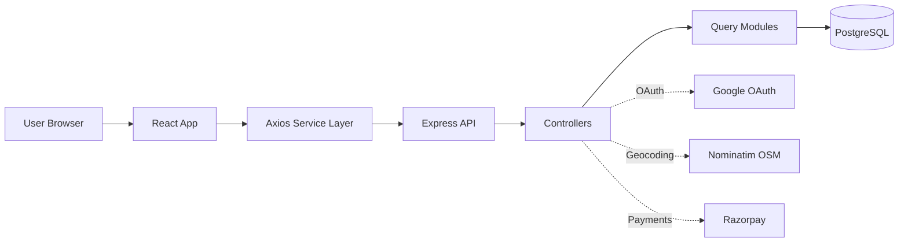
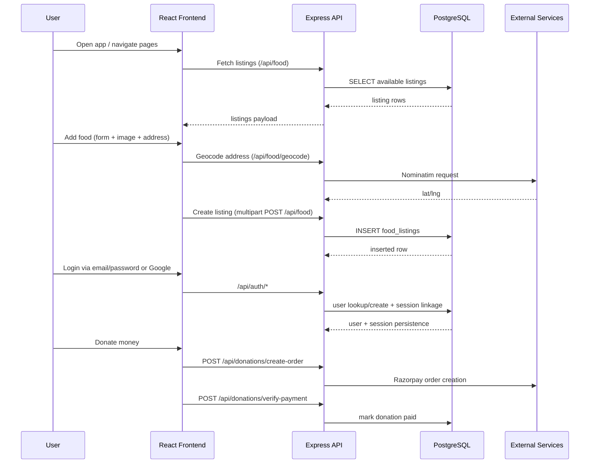
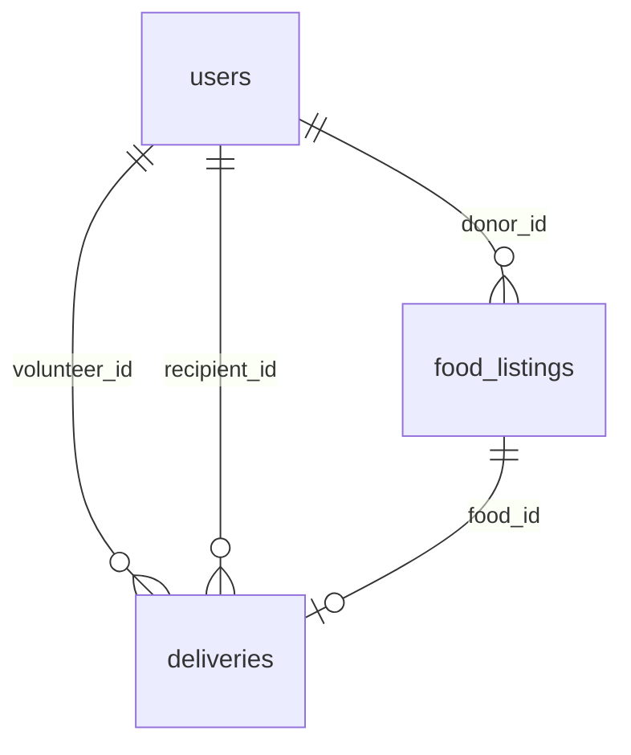

# 🌉 FoodBridge

> A full-stack food redistribution platform that connects surplus food with communities in need through location-aware discovery, secure authentication, and donation workflows.


---

## Table of Contents

- [Overview](#overview)
- [Key Features](#key-features)
- [Architecture](#architecture)
- [System Flow (End-to-End)](#system-flow-end-to-end)
- [Repository Structure](#repository-structure)
- [Tech Stack](#tech-stack)
- [External APIs & Integrations](#external-apis--integrations)
- [Data Model](#data-model)
- [API Surface](#api-surface)
- [Getting Started](#getting-started)
- [Environment Variables](#environment-variables)
- [Deployment Notes](#deployment-notes)
- [Operational Checklist](#operational-checklist)
- [Security & Reliability](#security--reliability)
- [Current Status / Known Gaps](#current-status--known-gaps)
- [Roadmap](#roadmap)
- [License](#license)

---

## Overview

FoodBridge helps reduce food waste by enabling donors to publish surplus food listings, recipients/volunteers to discover nearby listings, and supporters to contribute through monetary donations.

The platform is built as a modular monorepo with:

- **React frontend** (`client/`)
- **Express backend API** (`server/`)
- **PostgreSQL schema + query layer** (`database/`)

---

## Key Features

- 📍 **Location-aware food discovery**
  - Nearby listing fetch by radius
  - Interactive map view with marker grouping
- 🍱 **Food listing management**
  - Create/list/view/update/delete food listings
  - Image upload support
  - Geocode address to coordinates
- 🔐 **Authentication**
  - Email/password auth
  - Optional Google OAuth 2.0
  - Session-based auth with server-side session store
- 💳 **Donation workflow**
  - Razorpay order creation
  - Signature-based payment verification
  - Donation persistence in PostgreSQL
- 🧠 **AI-ready hooks**
  - Frontend + service scaffolding for quality checks
  - Backend route placeholder for quality analysis integration

---

## Architecture



### Design Highlights

- **Separation of concerns**
  - Routes define API contract
  - Controllers implement business logic
  - Query modules isolate SQL
- **Resilient frontend API config**
  - Environment-based API URL with Vercel fallback
  - Cookie credentials enabled by default for session auth
- **Production-minded middleware**
  - `helmet`, strict CORS origin handling, request logging

---

## System Flow (End-to-End)



---

## Repository Structure

```text
.
├── client/                    # React application
│   ├── public/
│   └── src/
│       ├── components/        # UI building blocks
│       ├── pages/             # Route-level pages
│       ├── services/          # API clients
│       ├── context/           # Auth + location providers
│       ├── hooks/             # Shared hooks
│       └── utils/             # Client-side helpers
├── server/                    # Express API
│   ├── config/                # DB, passport, multer, upload path
│   ├── controllers/           # Route handlers
│   ├── middleware/            # Error, auth, async wrappers
│   ├── routes/                # API endpoints
│   └── services/              # External service wrappers
├── database/
│   ├── schema.sql             # DB schema
│   ├── create_db.sql          # DB bootstrap
│   ├── seeds/seed.sql         # Seed data
│   └── queries/               # SQL query modules
└── docs/
    ├── api-reference.md
    └── database-design.md
```

---

## Tech Stack

| Layer | Technology | Why it is used |
|---|---|---|
| Frontend | React 18, React Router 6 | SPA routing, component-driven UI |
| API Client | Axios | Clean HTTP abstraction, interceptors, credentials support |
| Mapping | Leaflet + react-leaflet + OpenStreetMap | Fast map rendering and open geospatial tiles |
| Backend | Node.js + Express | Lightweight, modular HTTP server architecture |
| Database | PostgreSQL + `pg` | Relational consistency + strong query support |
| Auth | Passport + Google OAuth2 + express-session | Session-based auth and federated identity |
| Session Store | connect-pg-simple | Persist sessions in Postgres |
| Uploads | Multer | Multipart form handling for listing images |
| Security | Helmet + CORS | HTTP hardening and origin restrictions |
| Payments | Razorpay API + checkout.js | Donation checkout and signature verification |
| Tooling | Nodemon, Concurrently | Better local DX and parallel dev startup |

---

## External APIs & Integrations

| Integration | Purpose | Where used |
|---|---|---|
| Google OAuth 2.0 | Social login and identity bootstrap | `server/config/passport.config.js`, `server/routes/auth.routes.js` |
| OpenStreetMap Nominatim | Convert address to latitude/longitude | `GET /api/food/geocode` |
| Razorpay | Donation order + payment verification | `server/controllers/donation.controller.js`, `client/src/pages/DonateMoneyPage.jsx` |
| Cloudinary (optional) | Hosted image persistence for listing photos | `server/services/cloudinary.service.js` |

---

## Data Model

Core tables:

- `users` — account identity and role
- `food_listings` — donation listings with location, expiry, and status
- `deliveries` — claim + pickup + delivery lifecycle
- `donations` — transaction state for monetary support
- `user_sessions` — persistent server sessions



---

## API Surface

Base URL (local): `http://localhost:5000/api`

### Auth
- `POST /auth/register`
- `POST /auth/login`
- `GET /auth/google`
- `GET /auth/google/callback`
- `GET /auth/google/status`
- `GET /auth/me`
- `POST /auth/logout`

### Food
- `GET /food`
- `GET /food/nearby?lat=&lng=&radius=`
- `GET /food/geocode?address=`
- `GET /food/:id`
- `POST /food` (multipart)
- `PUT /food/:id`
- `DELETE /food/:id`

### Donations
- `POST /donations/create-order`
- `POST /donations/verify-payment`

### Health
- `GET /health`
- `GET /health/db`

> `deliveries` and `ai/check-quality` endpoints currently exist as scaffolds and return `501 Not Implemented`.

---

## Getting Started

### Prerequisites

- Node.js 18+
- npm 9+
- PostgreSQL 14+

### 1) Clone

```bash
git clone <your-repo-url>
cd FoodBRidge---demo
```

### 2) Install dependencies

```bash
npm run install:all
```

### 3) Create database + schema

```bash
createdb foodbridge_db
psql -d foodbridge_db -f database/schema.sql
psql -d foodbridge_db -f database/seeds/seed.sql   # optional
```

### 4) Configure environment

Create `server/.env` and set required variables (see table below).

### 5) Run locally

```bash
npm run dev
```

- Frontend: `http://localhost:3000`
- Backend API: `http://localhost:5000`

---

## Environment Variables

> Keep secrets out of source control. Use your deployment platform’s secret manager in production.

| Variable | Required | Description |
|---|---|---|
| `DATABASE_URL` | ✅ | PostgreSQL connection URI |
| `PG_SSL_REJECT_UNAUTHORIZED` | ⚪ | SSL strictness toggle (`true/false`) |
| `SESSION_SECRET` | ✅ | Session signing secret |
| `CLIENT_URL` | ✅ | Allowed frontend origin(s), comma-separated |
| `GOOGLE_CLIENT_ID` | ⚪ | Google OAuth client ID |
| `GOOGLE_CLIENT_SECRET` | ⚪ | Google OAuth client secret |
| `GOOGLE_CALLBACK_URL` | ⚪ | Explicit OAuth callback URL |
| `AI_API_URL` | ⚪ | AI provider endpoint (future integration) |
| `AI_API_KEY` | ⚪ | AI provider API key |
| `CLOUDINARY_CLOUD_NAME` | ⚪ | Cloudinary cloud name |
| `CLOUDINARY_UPLOAD_PRESET` | ⚪ | Cloudinary unsigned upload preset |
| `CLOUDINARY_FOLDER` | ⚪ | Optional Cloudinary folder |
| `RAZORPAY_KEY_ID` | ⚪ | Razorpay public key ID |
| `RAZORPAY_KEY_SECRET` | ⚪ | Razorpay secret for signing/verification |
| `REACT_APP_API_BASE_URL` | ⚪ | Frontend API base URL (client env) |
| `REACT_APP_ENABLE_GOOGLE_AUTH` | ⚪ | Toggle Google button in frontend |

---

## Deployment Notes

### Recommended split deployment

- Deploy `client/` and `server/` as separate services.
- Set CORS and cookie settings correctly for cross-origin session auth.
- Ensure `CLIENT_URL` includes exact frontend origin.
- Set `NODE_ENV=production`.

### Pre-deploy checks

- `GET /api/health` returns service status
- `GET /api/health/db` confirms DB connectivity
- `GET /api/auth/google/status` confirms OAuth readiness

---

## Operational Checklist

- [ ] Database migrations/schema applied
- [ ] Session secret rotated and secure
- [ ] HTTPS enabled in production
- [ ] CORS origins configured
- [ ] Payment keys configured (if donations enabled)
- [ ] OAuth callback and origins whitelisted
- [ ] Monitoring/logging configured

---

## Security & Reliability

- Security middleware via `helmet`
- Credentialed CORS with explicit allowlist
- Server-side session management
- Parameterized SQL queries (`pg`) to reduce injection risk
- Payment signature verification using HMAC
- Graceful fallback behaviors for optional integrations

---

## Current Status / Known Gaps

- ✅ Core food listing and map discovery flow implemented
- ✅ Authentication (email/password + optional Google OAuth)
- ✅ Donation order + verification flow
- ⚠️ Delivery workflow endpoints currently scaffolded (not implemented)
- ⚠️ AI quality-check endpoint currently scaffolded (not implemented)

---

## Roadmap

- [ ] Complete delivery claim/status lifecycle
- [ ] Production AI quality scoring integration
- [ ] Automated tests (unit + integration + E2E)
- [ ] CI pipeline (lint/test/build checks)
- [ ] API rate limiting and abuse protection
- [ ] Observability dashboards and alerts

---

## License

This repository currently has no explicit license file.  
If this project is public, add a `LICENSE` (MIT/Apache-2.0/etc.) to clarify usage rights.
